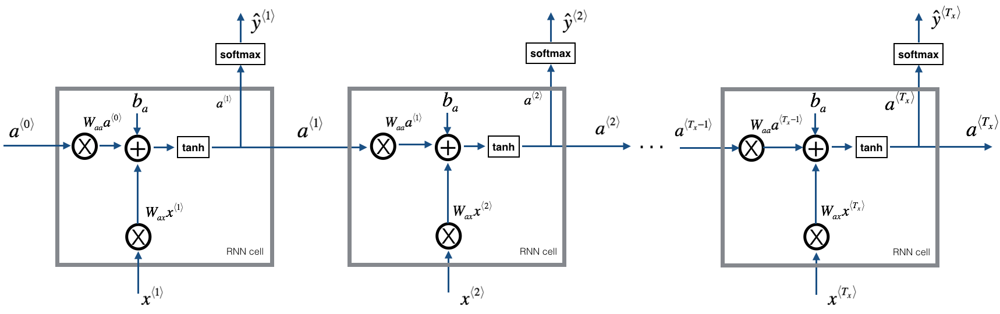

<h1 align="center">Welcome to Name Generator Using Recurrent Neural Networks 👋</h1>
<p>
  
  <a href="https://github.com/chaitanyarahalkar/Name-Generator-RNN#README">
    
  </a>
  <a href="https://github.com/kefranabg/readme-md-generator/graphs/commit-activity">
    
  </a>
  <a href="https://github.com/chaitanyarahalkar/Name-Generator-RNN/issues">
    
  </a>
  <a href="https://github.com/chaitanyarahalkar/Name-Generator-RNN/blob/master/LICENSE">
    
  </a>
  <a href="https://twitter.com/chairahalkar">
    
  </a>
</p>

> A Recurrent Neural Network Model that generates human names based on existing data. The entire model is implemented from scratch, without using any deep learning framework like Pytorch, Tensorflow etc. 

### 🏠 [Homepage](https://github.com/chaitanyarahalkar/Name-Generator-RNN)

## Prerequisites 
- Numpy (Install with Pip)

## Usage

```sh
jupyter lab or jupyter-notebook
```

## Overview of the Model

The model will have the following structure: 
- Initialize parameters 
- Run the optimization loop
    - Forward propagation to compute the loss function
    - Backward propagation to compute the gradients with respect to the loss function
    - Clip the gradients to avoid exploding gradients
    - Using the gradients, update your parameter with the gradient descent update rule.
- Return the learned parameters 
    


## Author

👤 **Chaitanya Rahalkar**

* Twitter: [@chairahalkar](https://twitter.com/chairahalkar)
* Github: [@chaitanyarahalkar](https://github.com/chaitanyarahalkar)

## 🤝 Contributing

Contributions, issues and feature requests are welcome!<br />Feel free to check [issues page](https://github.com/chaitanyarahalkar/Name-Generator-RNN/issues).

## Show your support

Give a ⭐️ if this project helped you!

## 📝 License

Copyright © 2019 [Chaitanya Rahalkar](https://github.com/chaitanyarahalkar).<br />
This project is [Apache-2.0](https://github.com/chaitanyarahalkar/Name-Generator-RNN/blob/master/LICENSE) licensed.

***
